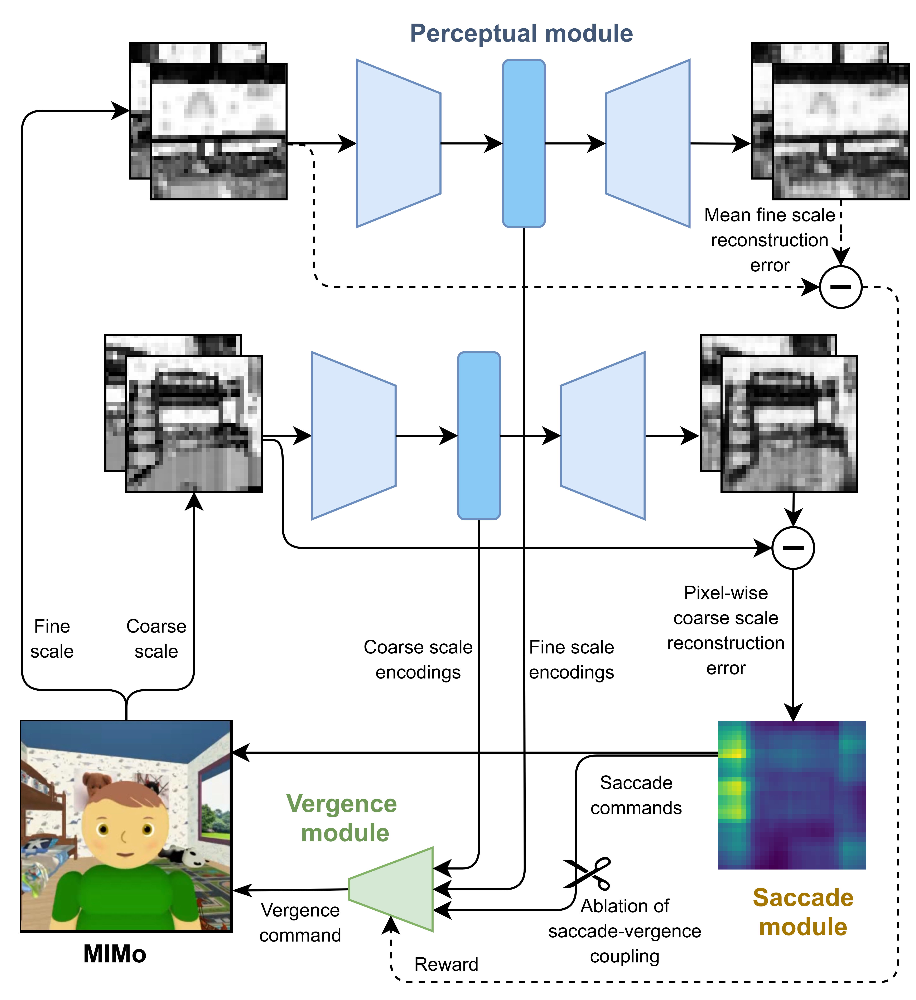

## Self-Calibrating Saccade-Vergence Interactions

  
    
This repository contains the code from [1]. Refer to the paper for a detailed explanation of the model. If you make use of this code, please cite as follows:

**López, F.M., Raabe, M.C., Shi, B.E., and Triesch, J. (2024) Self-Calibrating Saccade-Vergence Interactions. In *2023 IEEE International Conference on Development and Learning (ICDL).***

## Installation

The model was built and tested on [Python 3.10](https://www.python.org/downloads/release/python-3109/). We recommend using [Miniconda](https://conda.io/miniconda.html) to create an environment with the required libraries.

First, fork the repository into your own github account. Open a terminal in your computer, navigate to a work forlder, and clone the repository:

`git clone "URL_OF_YOUR_FORKED_REPOSITORY`

Navigate to the newly created folder and create a virtual environment with the [required libraries](requirements.txt):

`conda create -n saccade-vergence-interactions --file requirements.txt python=3.10`

Activate the virtual environment:

`source activate saccade-vergence-interactions`

Finally, install the MIMo platform [2]:

`pip install -e MIMo`

You should now be able to run the code. If you encounter any problems during installation, please [open an issue](https://github.com/trieschlab/saccade-vergence-interactions/issues).

## Testing embodiment

Before starting an experiment, make sure the code is installed correctly by running the embodimient. You can do by executing the following:

`python src/embodiment.py`

You can also visualize the embodiment with the following:

`python src/embodiment.py --animate`

## Running experiment

To run a full experiment, execute the following:

`python src/main.py --folder_name=test --n_epochs=10000 --save_every=1000`

## References

[1] López, F.M., Raabe, M.C., Shi, B.E., and Triesch, J. (2024) Self-Calibrating Saccade-Vergence Interactions. In *2023 IEEE International Conference on Development and Learning (ICDL).*

[2] Mattern, D., Schumacher, P., López, F. M., Raabe, M. C., Ernst, M. R., Aubret, A., & Triesch, J. (2024). MIMo: A Multi-Modal Infant Model for Studying Cognitive Development. *IEEE Transactions on Cognitive and Developmental Systems*.

## License

This project is licensed under the MIT License – see the [LICENSE](LICENSE) file for details.